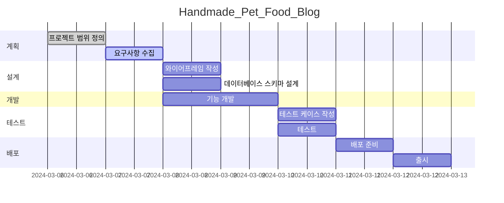

# Cellebmap

* **목표**
    * 좋아하는 셀럽/여행자들의 위치 정보 선택
    * 그들이 방문/추천한 관광지 데이터 수집 및 분석
    * LLM 기반 개인화된 여행 추천 서비스 제공

* **사용방법**
    1. 사용자 로그인 및 선호 여행 스타일 설정
    2. 관심 있는 셀럽/여행자 선택 및 팔로우
    3. 지도 기반 관광지 정보 확인 및 개인화된 추천 받기

* **서비스 URL 정보**
    * 배포 URL 정보 : 
    * 깃허브 링크(백엔드, 프론트 전체 코드 포함) : https://github.com/Cellebmap

* **앱 별 핵심 기능**
    * 인증된 사용자 기반 커뮤니티
      * 신뢰성 있는 여행 정보 공유
      * 실시간 현지 정보 업데이트

   * 맞춤형 여행지 추천
      * 사용자 선호도 기반 맞춤형 추천
      * LLM 서비스 활용 개인화된 정보 제공

   * 지도 기반 인터페이스
     * 직관적인 위치 정보 제공
     * 경로 최적화 추천
     
* **ERD**

* **WBS**

* **화면 정의서**
    <table>
        <tr>
            <th>스플래쉬 화면</th>
            <th>설명</th>
        </tr>
        <tr>
            <td width="70%">
            
            </td>
            <td>
                <ul>
                    <li>셀럽맵 로고 화면</li>
                    <li>셀럽맵 지도 화면으로 전환</li>
                    <li>웹 구동 시 가장 먼저 뜨는 화면</li>
                </ul>
            </td>
        </tr>
    </table>
    <table>
        <tr>
            <th>셀럽맵 화면</th>
            <th>설명</th>
        </tr>
        <tr width="70%">
            <td width="70%">
            

            </td>
            <td>
                <ul>
                    <li>게시물 사진이 바로 나오게끔 하기</li>
                    <li>해당 포스트에 대한 댓글 및 대댓글이 나오게끔 하기</li>
                </ul>
            </td>
        </tr>
    </table>
    <table>
        <tr>
            <th>댓글 및 대댓글 화면</th>
            <th>설명</th>
        </tr>
        <tr>
            <td width="70%">

            </td>
            <td>
                <ul>
                    <li>해당 게시글(포스트)에 해당 댓글 및 대댓글이 나타나게끔 하기</li>
                    <li>댓글에 대한 대댓글을 달 수 있게끔 하기</li>
                </ul>
            </td>
        </tr>
    </table>

* **과업**
    * 와이어 프레임에 제시된 3개의 화면 구현 완료(메인 화면, 포스트 화면, 댓글 및 대댓글 화면)
    * user 정보 입력
        * default는 config
        * 다른 분들과 함께 집필할 때에는 호출하게 했음
    * 썸네일 및 영상 업로드 기능 구현
    * CRUD 구현(저장-수정-삭제 기능 구현)
    * 로그인 기능 구현
    * 조회수 기능 구현
    * 작성자 지정 기능 구현
    * 인증 구현

* **향후 액션플랜**
    * 회원가입 기능 구현
    * 와이어프레임을 참고하여 프론트 화면 보완
    * blog URL 변경 필요
    * 가장 최신의 게시물을 맨 위에 게시 기능 구현 필요
    * 그 외 게시물들을 따로 목록화하는 기능 필요
    * 게시물 사진이 바로 나오게끔 하기
    * 해당 포스트에 대한 댓글 및 대댓글이 나오게끔 하기
    * 해당 게시글(포스트)에 해당 댓글 및 대댓글이 나타나게끔 하기
    * 댓글에 대한 대댓글을 달 수 있게끔 하기

* **애러와 애러 해결(트러블슈팅 히스토리)**
    * blog url 실현 X
        * tube에 들어가서 blog class 지정 후, url을 연동했으나 에러 발생
        * 멘토님께도 피드백받았으나, 시간 부족으로 추후 따로 보완할 예정
  
    * 검색기능 구현 시도, 모델 조회 파트에서 오류
        * search 모델 구현 후, 조회 코드 추가 예정

* **API 명세서**

[Swagger](localhost:8000)  

|app: accounts|HTTP Method|설명|로그인 권한 필요|작성자 권한 필요|Admin 권한|
|:-|:-|:-|:-:|:-:|:-:|
|'login/'|POST|유저 로그인|||
|'logout/'|POST|유저 로그아웃|✅||
|'register-admin/'|POST|관리자 계정 생성|||✅|
|'register/'|POST|일반 사용자 계정 생성|||
|'user/'|GET|현재 로그인한 사용자 정보 조회|✅||
|'users/'|GET|전체 사용자 목록 조회|||✅|
|'<int:pk>/'|GET|특정 사용자 정보 조회|||✅|
|'<int:pk>/'|PUT|특정 사용자 정보 수정||✅|✅|
|'<int:pk>/'|PATCH|특정 사용자 정보 부분 수정||✅|✅|
|'<int:pk>/'|DELETE|특정 사용자 삭제|||✅|
|'<int:pk>/delete/'|DELETE|특정 사용자 삭제|||✅|
|'<int:pk>/tokens/generate/'|POST|특정 사용자 토큰 생성|||✅|
 

|app: alarm|HTTP Method|설명|로그인 권한 필요|작성자 권한 필요|Admin 권한|
|:-|:-|:-|:-:|:-:|:-:|
|'alarms/'|GET|전체 알람 목록 조회|✅||
|'alarms/'|POST|새로운 알람 생성|✅||
|'alarms/<int:pk>/'|GET|특정 알람 조회|✅||
|'alarms/<int:pk>/'|PUT|특정 알람 수정|✅|✅|
|'alarms/<int:pk>/'|PATCH|특정 알람 부분 수정|✅|✅|
|'alarms/<int:pk>/'|DELETE|특정 알람 삭제|✅|✅|
|'risks/'|GET|전체 위험 목록 조회|✅||
|'risks/'|POST|새로운 위험 생성|✅||
|'risks/<int:pk>/'|GET|특정 위험 조회|✅||
|'risks/<int:pk>/'|PUT|특정 위험 수정|✅|✅|
|'risks/<int:pk>/'|PATCH|특정 위험 부분 수정|✅|✅|
|'risks/<int:pk>/'|DELETE|특정 위험 삭제|✅|✅|
|'alarm-types/'|GET|전체 알람 유형 목록 조회|✅||
|'alarm-types/'|POST|새로운 알람 유형 생성|✅||✅|
|'alarm-types/<int:pk>/'|GET|특정 알람 유형 조회|✅||
|'alarm-types/<int:pk>/'|PUT|특정 알람 유형 수정|✅||✅|
|'alarm-types/<int:pk>/'|PATCH|특정 알람 유형 부분 수정|✅||✅|
|'alarm-types/<int:pk>/'|DELETE|특정 알람 유형 삭제|✅||✅|
|'receive-alarm-data/'|POST|알람 데이터 수신|||✅|
 

|app: chat|HTTP Method|설명|로그인 권한 필요|작성자 권한 필요|Admin 권한|
|:-|:-|:-|:-:|:-:|:-:|
|'rooms/'|GET|전체 채팅방 목록 조회|✅|||
|'rooms/'|POST|새로운 채팅방 생성|✅|||
|'rooms/<int:pk>/'|GET|특정 채팅방 조회|✅|||
|'rooms/<int:pk>/'|PUT|특정 채팅방 수정|✅|✅||
|'rooms/<int:pk>/'|PATCH|특정 채팅방 부분 수정|✅|✅||
|'rooms/<int:pk>/'|DELETE|특정 채팅방 삭제|✅|✅||
|'rooms/<int:room_pk>/messages/'|GET|특정 채팅방 메시지 목록 조회|✅|||
|'rooms/<int:room_pk>/messages/'|POST|특정 채팅방에 새로운 메시지 생성|✅|||
|'rooms/<int:room_pk>/messages/<int:pk>/'|GET|특정 채팅방의 특정 메시지 조회|✅|||
|'rooms/<int:room_pk>/messages/<int:pk>/'|PUT|특정 채팅방의 특정 메시지 수정|✅|✅||
|'rooms/<int:room_pk>/messages/<int:pk>/'|PATCH|특정 채팅방의 특정 메시지 부분 수정|✅|✅||
|'rooms/<int:room_pk>/messages/<int:pk>/'|DELETE|특정 채팅방의 특정 메시지 삭제|✅|✅||
 

|app: media|HTTP Method|설명|로그인 권한 필요|작성자 권한 필요|Admin 권한|
|:-|:-|:-|:-:|:-:|:-:|
|'files/'|GET|전체 미디어 파일 목록 조회|✅|||
|'files/'|POST|새로운 미디어 파일 업로드|✅|||
|'files/<int:pk>/'|GET|특정 미디어 파일 조회|✅|||
|'files/<int:pk>/'|PUT|특정 미디어 파일 수정|✅|✅||
|'files/<int:pk>/'|PATCH|특정 미디어 파일 부분 수정|✅|✅||
|'files/<int:pk>/'|DELETE|특정 미디어 파일 삭제|✅|✅||
|'files/<int:pk>/predict/'|POST|특정 미디어 파일 예측|✅|||
 

|app: notice|HTTP Method|설명|로그인 권한 필요|작성자 권한 필요|Admin 권한|
|:-|:-|:-|:-:|:-:|:-:|
|''|GET|전체 공지사항 목록 조회||||
|''|POST|새로운 공지사항 생성|||✅|
|'<int:pk>/'|GET|특정 공지사항 조회||||
|'<int:pk>/'|PUT|특정 공지사항 수정|||✅|
|'<int:pk>/'|PATCH|특정 공지사항 부분 수정|||✅|
|'<int:pk>/'|DELETE|특정 공지사항 삭제|||✅|
 

* **활용한 언어 및 툴 정리**
    * Python
    * HTML/CSS/JS
    * Django
    * 노션
    * Git
    * VS code
